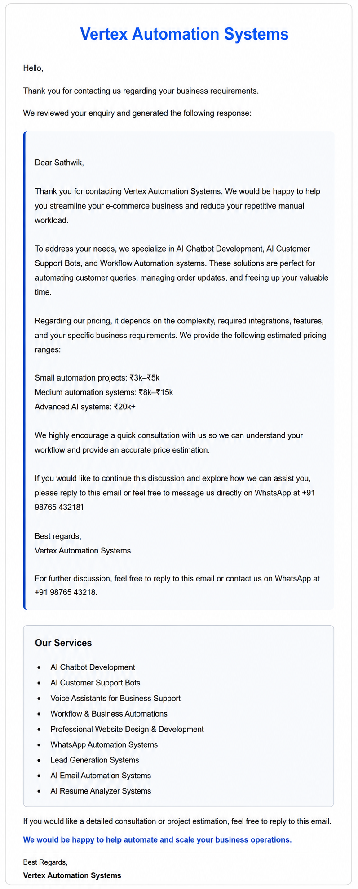
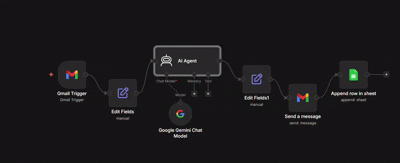

# AI Email Auto Reply Assistant

## Overview:
AI Email Auto Reply Assistant is an AI-powered business email automation system that automatically reads customer inquiries and generates professional business email replies using Google Gemini AI and workflow automation.The system helps businesses automate repetitive communication workflows, improve customer response speed, and reduce manual email handling processes through intelligent AI-generated responses.

The workflow continuously monitors incoming Gmail messages, analyzes customer inquiries, generates contextual business replies using Gemini AI, formats professional email responses, and automatically sends replies to customers.

## Features:

1.AI-generated email replies

2.Automated Gmail response workflow

3.Customer inquiry analysis

4.Professional business email generation

5.Google Gemini AI integration

6.Automated communication workflow

## Tech Stack:

1.n8n: Workflow automation platform used to automate email response workflows.

2.Google Gemini AI: Generates professional AI-powered email replies based on customer inquiries.

3.Gmail API: Reads incoming emails and sends automated responses.

4.Google Sheets API: Stores customer inquiry and response data.
  
5.Workflow Automation: Automates business communication processes.

  
## Workflow Flow

Incoming Gmail Message → Gmail Trigger → Customer Inquiry Extraction → Gemini AI Reply Generation → Professional Email Formatting → Automated Email Response → Google Sheets Data Storage

## Demo:

### Automated Business Email Response

### Workflow Demo

## Challenges Solved:

1.Helps businesses ensure faster customer response times.

2.Reduces manual email handling workload.

3.Automates repetitive business communication tasks.

## Use Cases:

1. AI-powered customer support and business email automation system

2. Intelligent business communication workflow automation for enterprises

3. Automated customer inquiry handling and professional response generation

4. Scalable AI-driven email response system for support and service teams

## Author

Developed by Sathwik
